# 課堂任務管理器實作報告

課程：＿＿＿＿＿＿＿＿＿＿　班級：＿＿＿＿＿＿＿＿＿＿  
姓名：＿＿＿＿＿＿＿＿＿＿　學號：＿＿＿＿＿＿＿＿＿＿  
日期：2026 年 9 月 30 日

## 一　作品與提交資訊

本作品是可直接執行的靜態 Web App，包含原生 JavaScript 版與獨立 Vue 3 版。原生版完成新增、空白檢查、完成與取消完成、刪除、全部／未完成／已完成篩選和即時統計；Vue 版完成啟動、新增、完成與取消完成、刪除和統計。兩個版本的任務陣列互相獨立，重新整理頁面後任務會清空。

- GitHub 原始碼：<https://github.com/WenAnChang19/task-manager-classwork>（公開，不需登入）
- 原生版網站：<https://wenanchang19.github.io/task-manager-classwork/>（已發布並驗證）
- Vue 版網站：<https://wenanchang19.github.io/task-manager-classwork/vue.html>（已發布並驗證）
- 原生版入口：[index.html](index.html)
- Vue 版入口：[vue.html](vue.html)
- 測試環境：Chromium 151.0.7922.34，由 Playwright 自動操作
- 自動測試結果：TC01–TC10 與延伸檢查 EX01 共 11 項，全部 PASS

提交時提供上述 GitHub 儲存庫連結即可，首頁連到線上網站、原始碼及本報告。也可下載儲存庫後直接開啟 `index.html` 與 `vue.html`；Vue 執行檔已放在 `vendor/`，一般使用不需要安裝 npm、執行建置或連線 CDN。

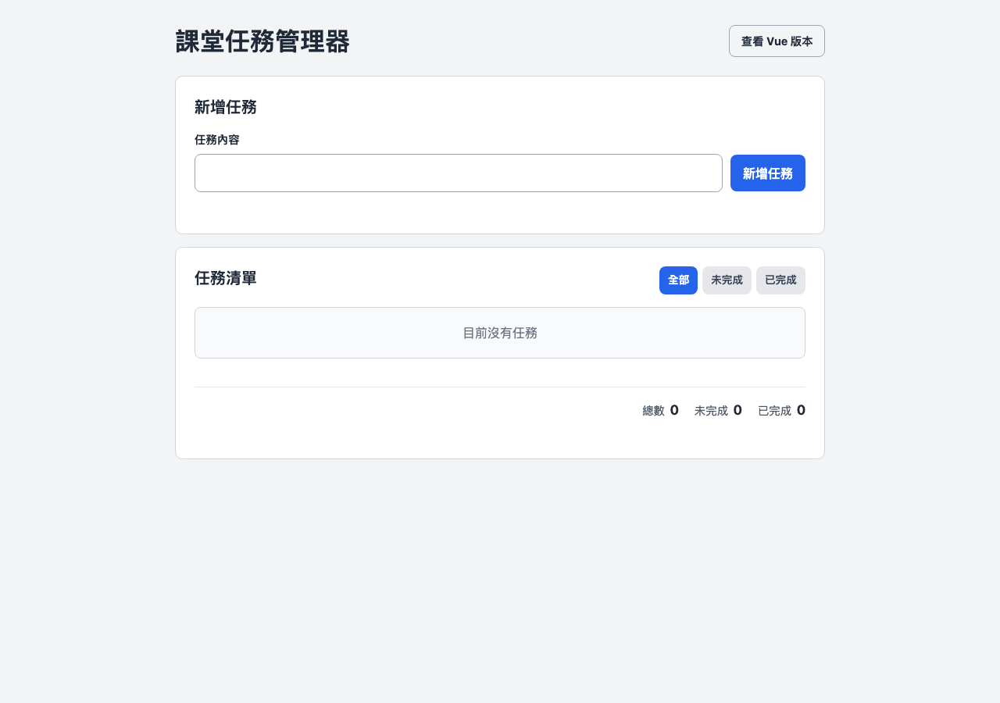

圖 1　原生版桌面完整畫面，包含標題、新增表單、篩選、清單與統計。

重新整理後仍保留基本介面，任務資料則重置；以下是實際重新整理後的完整畫面。


## 二　檔案與執行方式

| 檔案 | 用途 |
| --- | --- |
| [`index.html`](index.html) | 原生版語意化 HTML 與操作入口 |
| [`styles.css`](styles.css) | 兩個版本共用的版面、RWD、hover 與 focus 樣式 |
| [`app.js`](app.js) | 原生版任務資料、事件處理、篩選、統計與 DOM 更新 |
| [`vue.html`](vue.html) | Vue 模板與 `#vue-app` 掛載區 |
| [`vue-app.js`](vue-app.js) | Vue 的 `data`、`methods` 與 `computed` |
| [`vendor/vue.global.prod.js`](vendor/vue.global.prod.js) | 專案內附的 Vue 3 production global build |
| [`THIRD_PARTY_NOTICES.md`](THIRD_PARTY_NOTICES.md) | Vue 來源與授權說明 |
| [`tests/browser-test.cjs`](tests/browser-test.cjs) | Playwright 瀏覽器自動測試 |
| [`submission/report-evidence/`](submission/report-evidence/) | 本報告使用的可讀操作截圖與擷取結果 |

直接執行：下載或 clone 儲存庫後，以瀏覽器開啟 `index.html`；右上角連結可切換到 `vue.html`。也可在專案目錄啟動本機伺服器：

```sh
python3 -m http.server 8765 --bind 127.0.0.1
```

再開啟 `http://127.0.0.1:8765/`。這是本機預覽位址，不能當作老師可遠端開啟的公開網址。

開發驗證命令如下；一般使用網站不需要執行這些命令。

```sh
npm install
npx playwright install chromium
npm run check
npm test
```

## 三　題目查核矩陣

下表只對照要求、實作位置與可查證證據，不預測成績。

| 查核點 | 實作結果 | 程式位置 | 報告證據 |
| --- | --- | --- | --- |
| 1-1 | 有標題、輸入、新增、清單、篩選、統計；重新整理後介面仍在 | `index.html`、`app.js` | 圖 1、TC01、EX01 |
| 1-2 | 使用 `header`、`main`、`section`、`button`、`label`、`ul`／動態 `li`，並以註解標示重要區域 | `index.html` 第 42–61 行 | 第四節程式片段 |
| 2-1 | 新增與清單分區清楚，輸入欄、按鈕與任務層次可辨識 | `styles.css` | 圖 1、圖 6 |
| 2-2 | 480px 以下改為直向排列，長字串可換行，無水平溢出 | `styles.css` 的 `@media` | 圖 2、TC09 |
| 2-3 | 新增、刪除、篩選、連結有 hover；控制項有 `focus-visible` | `styles.css` | 圖 3、擷取紀錄 |
| 3-1 | 可新增一般任務，`trim()` 後拒絕空字串與純空白 | `app.js` | 圖 4、圖 5、TC01–02 |
| 3-2 | 核取方塊可完成與取消完成，樣式及統計同步 | `app.js` | 圖 6、TC03–04 |
| 3-3 | 依任務 ID 刪除指定任務，其餘任務保留 | `app.js` | 圖 7、TC05 |
| 3-4 | 全部、未完成、已完成三種篩選不改動原始任務陣列 | `app.js` | 圖 8、TC06–07 |
| 3-5 | 以完整 `tasks` 陣列計算總數、未完成、已完成 | `app.js` | 圖 9、TC08 |
| 4 | 提供 28 行新增相關程式，指出資料、新增與畫面更新 | `app.js` 第 3–30 行 | 第七節 |
| 5-1 | Vue 3 在 `#vue-app` 正常掛載 | `vue.html`、`vue-app.js` | 圖 10、TC10 |
| 5-2 | `v-model` 與 `addTask()` 完成新增與空白檢查 | `vue-app.js` | 圖 10、TC10 |
| 5-3 | `toggleTask()` 完成勾選與取消勾選 | `vue-app.js` | 圖 11、TC10 |
| 5-4 | `deleteTask()` 刪除資料並更新畫面 | `vue-app.js` | 圖 12、TC10 |

## 四　HTML 介面與語意結構

原生版以 `header` 放置作品標題與版本切換，以 `main` 包住主要內容。新增區使用 `form` 和對應輸入欄的 `label`；任務區使用 `section`、標題關聯、篩選按鈕、`ul` 清單及統計區。下列片段是實際 [`index.html`](index.html) 第 42–61 行：

```html
<!-- 重要語意區：任務清單與操作狀態集中在這個 section。 -->
<section class="panel task-panel" aria-labelledby="list-heading">
  <div class="section-heading">
    <h2 id="list-heading">任務清單</h2>
    <div class="filters" aria-label="篩選任務">
      <button class="filter-button" type="button" data-filter="all" aria-pressed="true">全部</button>
      <button class="filter-button" type="button" data-filter="pending" aria-pressed="false">未完成</button>
      <button class="filter-button" type="button" data-filter="completed" aria-pressed="false">已完成</button>
    </div>
  </div>

  <p id="empty-state" class="empty-state">目前沒有任務</p>
  <ul id="task-list" class="task-list" aria-label="任務"></ul>

  <div id="stats" class="stats" aria-label="任務統計">
    <p>總數 <strong id="total-count">0</strong></p>
    <p>未完成 <strong id="pending-count">0</strong></p>
    <p>已完成 <strong id="completed-count">0</strong></p>
  </div>
</section>
```

`section` 透過 `aria-labelledby` 連到「任務清單」標題。靜態 HTML 先提供空的 `ul`；新增任務後，JavaScript 會建立真正的 `li`，每一項包含有文字標籤的 checkbox 與刪除 `button`。使用者輸入以 `textContent` 放入 `span.task-name`，不會被瀏覽器當作 HTML 執行。

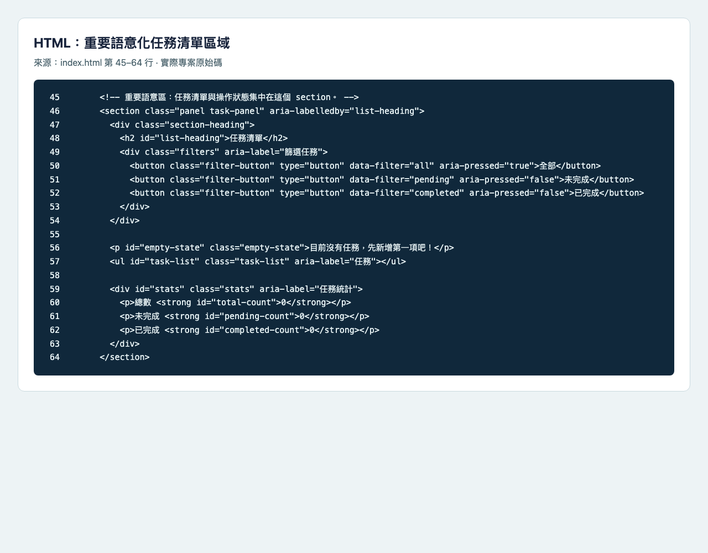

## 五　CSS 版面　RWD 與互動狀態

桌面版採灰白背景、白色面板與藍色主要按鈕。`.page-width` 限制內容寬度，任務項目使用 grid 配置文字與刪除按鈕。`overflow-wrap: anywhere` 讓無空格長字串也能換行。

當寬度不超過 480px，標題列、表單與區段標題改成直向排列，新增按鈕填滿寬度，三個篩選按鈕維持三欄。Playwright 在 480、375、320px 都檢查 `scrollWidth` 不大於 viewport，並確認輸入、按鈕和刪除操作留在畫面內。


圖 2　375px 手機畫面；長字串換行，新增、篩選與刪除按鈕均在視窗內。

| hover 前 | hover 後 |
| --- | --- |
|  |  |

圖 3　新增按鈕背景色由 `rgb(37, 99, 235)` 變為 `rgb(29, 78, 216)`。鍵盤 Tab 可將焦點移到輸入欄，並顯示 3px 藍色 `focus-visible` 外框；證據見 [focus-input.png](submission/report-evidence/focus-input.png)。

## 六　原生 JavaScript 功能與操作證據

### 6.1 新增與空白檢查

表單提交時先用 `trim()` 移除頭尾空白。內容有效時加入 `{ id, name, completed: false }`，重設表單並重畫清單；空字串或純空白則顯示提示，不加入陣列。

| TC01 新增前 | TC01 新增後 |
| --- | --- |
|  |  |

圖 4　新增前清單為空；新增後出現「完成 Web App 實作」，輸入清空，統計為 1／1／0。

| TC02 空白送出前 | TC02 空白送出後 |
| --- | --- |
|  | 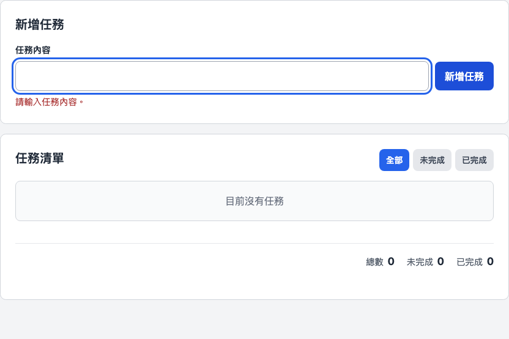 |

圖 5　送出純空白後沒有產生任務，提示「請輸入任務內容。」，統計維持 0／0／0。

### 6.2 完成與取消完成

清單使用事件委派監聽 checkbox 的 `change`。程式依 `data-task-id` 找到對應資料，更新 `completed` 後呼叫 `renderTasks()`；再次取消勾選時使用相同流程恢復未完成。

| TC03 未完成 | TC03 完成 |
| --- | --- |
|  |  |

圖 6　完成後 checkbox 勾選、文字加上完成樣式，統計由 1／1／0 更新為 1／0／1；[取消完成證據](submission/report-evidence/untoggle-after.png)顯示統計恢復 1／1／0。

### 6.3 刪除指定任務

刪除按鈕帶有任務 ID。程式用 `findIndex()` 找到資料，再用 `splice()` 移除。下列 TC05 證據完整記錄操作前後，符合至少兩項 Test Case 需有前後證據的要求之一。

| TC05 刪除前 | TC05 刪除後 |
| --- | --- |
| 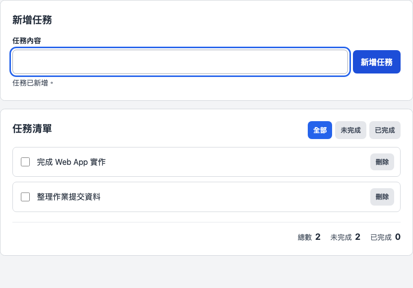 | 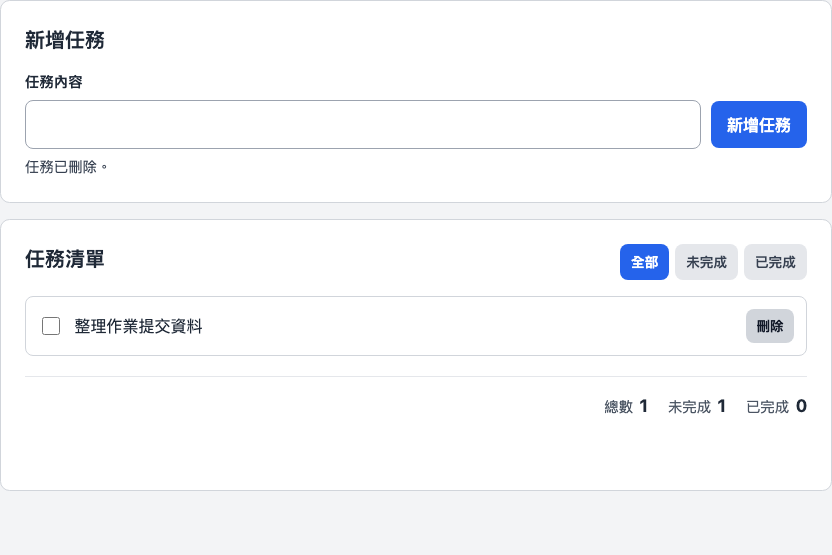 |

圖 7　刪除「完成 Web App 實作」後，只保留「整理作業提交資料」，統計由 2／2／0 變成 1／1／0。

### 6.4 三種篩選

三張圖使用同一組資料：依序為 Web App、JavaScript、提交資料，中間的 JavaScript 任務已完成。篩選只建立顯示用陣列，不會改動原始 `tasks`，所以三種畫面的整體統計都維持 3／2／1。

| 全部 | 未完成 | 已完成 |
| --- | --- | --- |
| 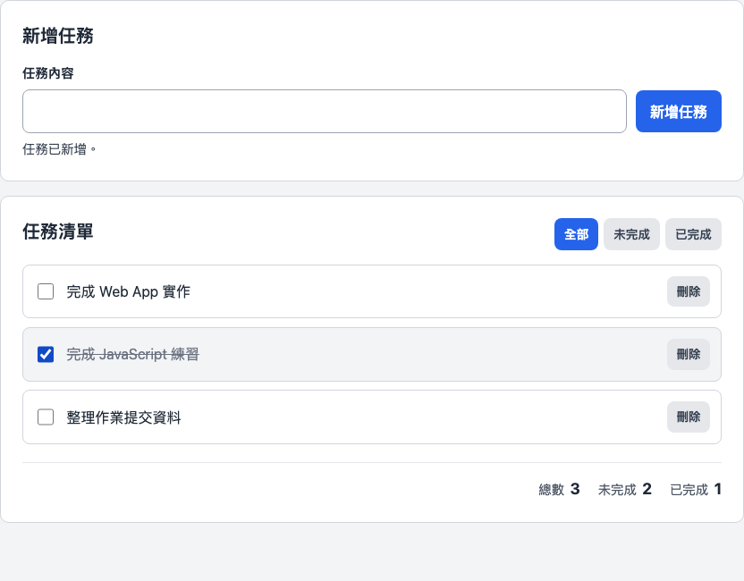 | 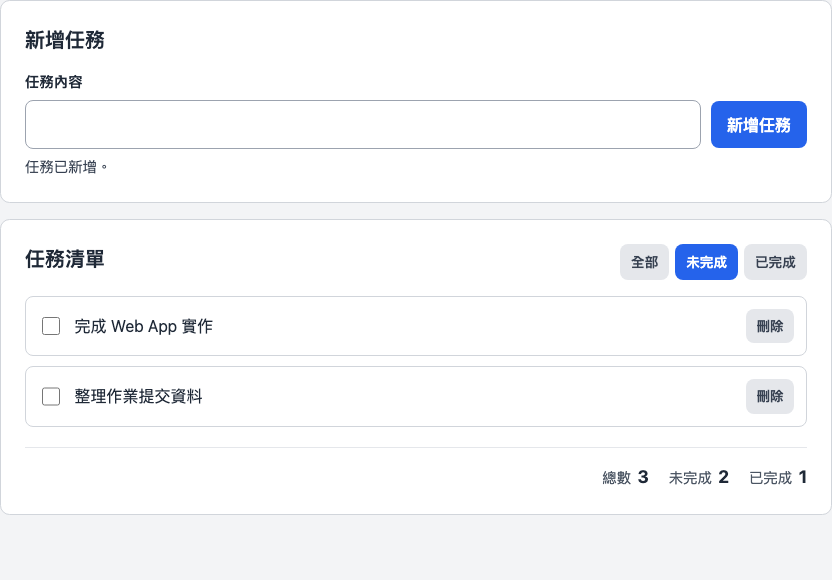 | 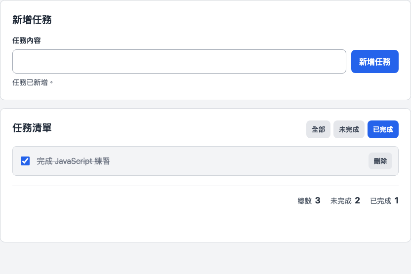 |

圖 8　全部顯示三項；未完成顯示第一與第三項；已完成只顯示中間任務。

### 6.5 統計同步

`updateSummary()` 從完整 `tasks` 陣列計算完成數，再以總數減完成數得到未完成數，因此切換篩選不會改變統計。

| TC08 完成前 | TC08 完成後 |
| --- | --- |
|  | 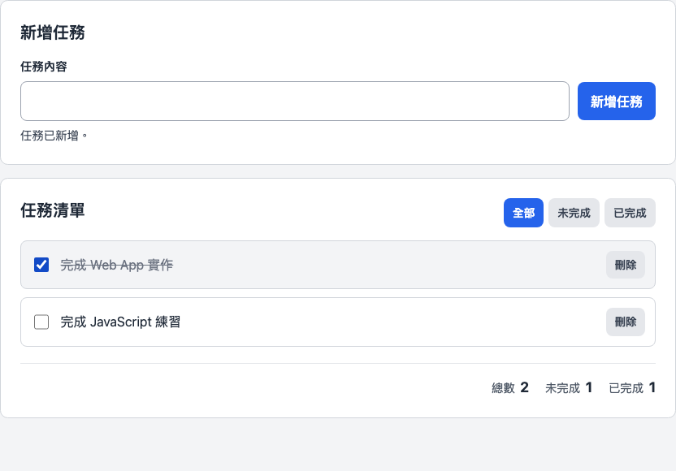 |

圖 9　將第一項標成完成後，統計由 2／2／0 更新為 2／1／1。

## 七　新增程式片段與資料流程

下列是實際 [`app.js`](app.js) 第 3–30 行，共 28 行，符合題目要求的 10–30 行範圍。

```js
const tasks = [];
let nextTaskId = 1;
let activeFilter = "all";

const taskForm = document.querySelector("#task-form");
const taskInput = document.querySelector("#task-input");
const taskList = document.querySelector("#task-list");
const formMessage = document.querySelector("#form-message");
const emptyState = document.querySelector("#empty-state");
const filterButtons = document.querySelectorAll(".filter-button");

taskForm.addEventListener("submit", (event) => {
  event.preventDefault();
  const taskName = taskInput.value.trim();

  if (!taskName) {
    showMessage("請輸入任務內容。", true);
    taskInput.focus();
    return;
  }

  tasks.push({ id: nextTaskId, name: taskName, completed: false });
  nextTaskId += 1;
  taskForm.reset();
  showMessage("任務已新增。", false);
  renderTasks();
  taskInput.focus();
});
```

- 保存任務的資料：`tasks` 是陣列；每筆資料包含 `id`、`name`、`completed`。
- 新增任務的位置：`tasks.push(...)` 加入一筆預設未完成的任務。
- 更新畫面的位置：新增完成後呼叫 `renderTasks()`，重新產生清單並接著更新統計。
- 輸入檢查：`trim()` 搭配 `if (!taskName)` 同時拒絕空字串與純空白。
- ID 用途：`nextTaskId` 每次加一，即使任務同名也能準確完成或刪除指定項目。

完整流程是「事件修改 `tasks` → `renderTasks()` 依目前篩選建立 `li` → `updateSummary()` 依完整陣列更新三個數字」。完成、刪除和篩選的實作可直接在 [`app.js`](app.js) 查看。

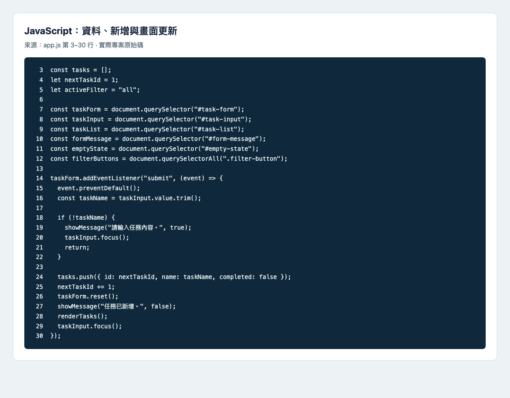

## 八　Vue 3 版本

Vue 版使用 Options API。`data()` 提供 `tasks`、下一個 ID、輸入內容和訊息；`v-model` 連動輸入；`v-for` 依任務陣列建立清單；`computed` 計算總數、未完成與已完成。資料變更後由 Vue 更新畫面，不需要手動呼叫 `renderTasks()`。

| 5-1 初始掛載 | 5-2 新增後 |
| --- | --- |
| 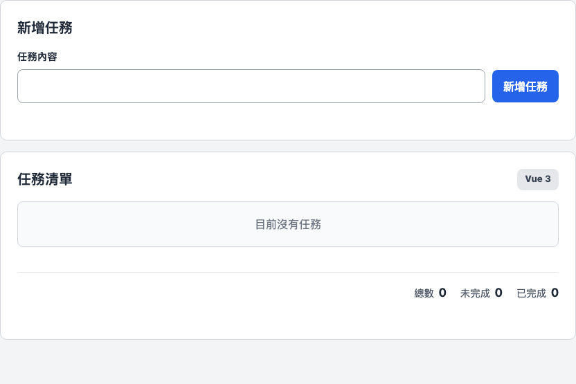 | 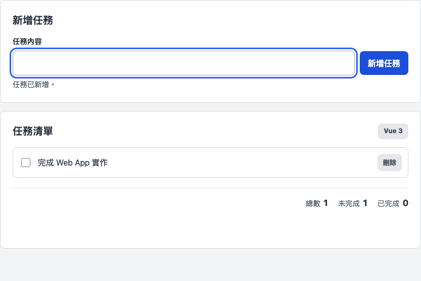 |

圖 10　Vue 成功掛載，初始統計 0／0／0；新增後顯示一項任務與 1／1／0。

| 5-3 完成 | 5-3 取消完成 |
| --- | --- |
| 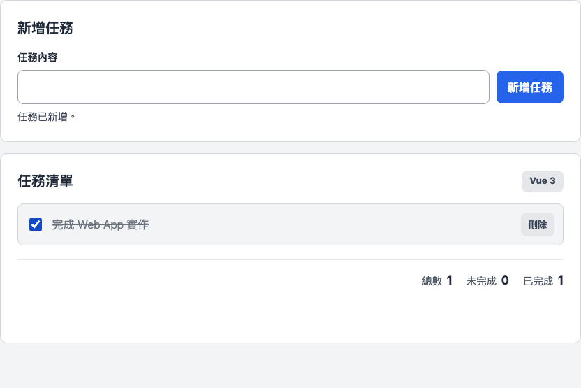 | 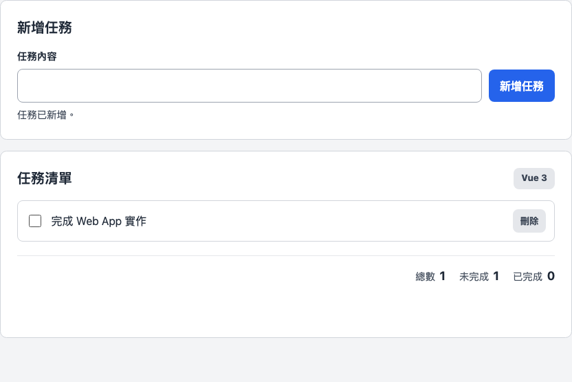 |

圖 11　`toggleTask()` 讓統計在 1／0／1 與 1／1／0 之間正確更新。

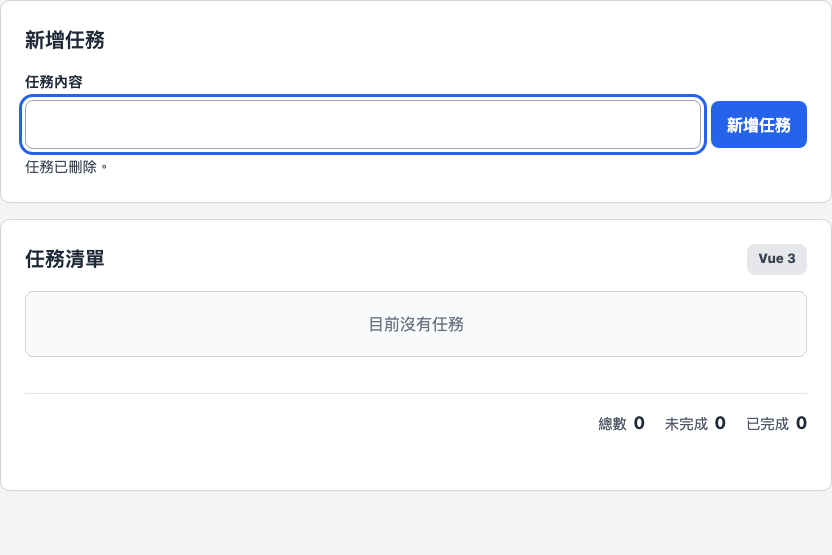

圖 12　`deleteTask()` 刪除唯一任務後，清單回到空狀態，統計為 0／0／0。

## 九　自動測試表

執行者：Codex 使用 Playwright 自動操作 Chromium；不是學生親自測試紀錄。  
執行時間：2026-09-30 15:57:01（Asia/Taipei）。  
瀏覽器：Chromium 151.0.7922.34。  
結果：TC01–TC10 與延伸檢查 EX01 共 11 項，全部 PASS。

| Test Case | 測試內容 | 預期結果 | 實際結果 | 結果 | 證據 |
| --- | --- | --- | --- | --- | --- |
| TC01 | 新增正常任務 | 任務出現，輸入欄清空，統計 1／1／0 | 任務出現、輸入清空；統計 1／1／0 | PASS | [前](submission/report-evidence/add-before.png)／[後](submission/report-evidence/add-after.png) |
| TC02 | 新增空白任務 | 空字串與純空白皆不新增並顯示提示 | 兩種空白都沒有新增，顯示提示 | PASS | [前](submission/report-evidence/blank-before.png)／[後](submission/report-evidence/blank-after.png) |
| TC03 | 完成任務 | 勾選後變成已完成，統計同步 | 已勾選並顯示完成樣式；統計 1／0／1 | PASS | [前](submission/report-evidence/toggle-before.png)／[後](submission/report-evidence/toggle-after.png) |
| TC04 | 取消完成 | 取消勾選後恢復未完成 | 勾選取消、完成樣式移除；統計 1／1／0 | PASS | [取消前](submission/report-evidence/toggle-after.png)／[取消後](submission/report-evidence/untoggle-after.png) |
| TC05 | 刪除任務 | 指定任務消失，其餘任務保留 | 指定任務消失，另一項保留；統計 1／1／0 | PASS | [前](submission/report-evidence/delete-before.png)／[後](submission/report-evidence/delete-after.png) |
| TC06 | 篩選未完成 | 只顯示未完成，切回全部恢復所有任務 | 未完成只顯示第一與第三項；全部顯示三項；統計維持 3／2／1 | PASS | [全部](submission/report-evidence/filter-all.png)／[未完成](submission/report-evidence/filter-pending.png) |
| TC07 | 篩選已完成 | 只顯示已完成；沒有符合項目時顯示提示 | 只顯示中間的已完成任務；取消完成後篩選結果為空 | PASS | [已完成](submission/report-evidence/filter-completed.png) |
| TC08 | 統計數字 | 新增、完成、刪除、篩選後皆正確 | 依序驗證 0／0／0、2／2／0、2／1／1、1／1／0；篩選不改變統計 | PASS | [前](submission/report-evidence/stats-before.png)／[後](submission/report-evidence/stats-after.png) |
| TC09 | 手機尺寸 | 480、375、320px 長文字不溢出，按鈕可操作 | 三種寬度皆無水平溢出；新增、篩選、完成、刪除可操作 | PASS | [375px 代表畫面](submission/report-evidence/mobile375.png) |
| TC10 | Vue 功能 | Vue 啟動，新增、完成／取消、刪除立即更新 | Vue 已掛載；所有操作更新正確，拒絕空白；320px 無溢出 | PASS | [初始](submission/report-evidence/vue-initial.png)／[新增](submission/report-evidence/vue-add.png)／[完成](submission/report-evidence/vue-completed.png)／[取消](submission/report-evidence/vue-uncompleted.png)／[刪除](submission/report-evidence/vue-deleted.png) |
| EX01 | 語意、重新整理、鍵盤、文字安全 | 基本 UI 保留，Enter 新增，HTML 字串不執行 | 語意結構存在；Enter、Space 與鍵盤按鈕操作成功；文字安全；重新整理保留 UI | PASS | [完整介面](submission/report-evidence/desktop-overall.png)／[focus](submission/report-evidence/focus-input.png) |

TC02 與 TC05 均已在第六節以操作前／後圖片完整呈現。自動測試也驗證任務名稱透過 `textContent` 或 Vue 文字插值顯示，輸入 `` 時不會建立圖片元素；重新整理後任務清空，但表單、清單區與統計介面仍存在。

較適合閱讀報告的 25 張截圖另由一次 Playwright 擷取流程產生，結果記錄在 [`capture_results.json`](submission/report-evidence/capture_results.json)：25 張皆 PASS，失敗數為 0。這批截圖用來呈現本報告畫面，不取代上表 TC01–TC10 的測試判定。

### 公開 GitHub Pages 驗證

2026-09-30 16:03:32（Asia/Taipei），Codex 使用 Playwright 在公開 HTTPS 網址實際操作，9 項檢查全部 PASS，未觀察到 console、JavaScript、網路請求或 HTTP 錯誤。此紀錄仍屬 AI 自動測試。

| 檢查 | 實際結果 |
| --- | --- |
| 原生版與資源 | 首頁及 CSS／JS 回應 200，Vue 切換連結保留儲存庫子路徑 |
| 原生新增、空白、完成／取消、刪除 | 操作成功，清單及統計同步更新 |
| 原生三種篩選 | 全部 3、未完成 2、已完成 1；統計均為 3／2／1 |
| 375px 手機版 | 長字串換行，沒有水平溢出，所有按鈕在視窗內 |
| Vue 啟動與操作 | 啟動、新增、拒絕空白、完成／取消與刪除皆成功 |
| 公開存取與檔案一致性 | 儲存庫及網站不需登入；6 個線上程式檔與本機逐位元組一致 |

完整結果：[部署操作驗證](submission/report-evidence/deployment-results.json)、[公開檔案比對](submission/report-evidence/deployment-files.json)、[本機測試原始結果](evidence/test-results.json)。

| 公開原生版 | 公開 Vue 版 |
| --- | --- |
| 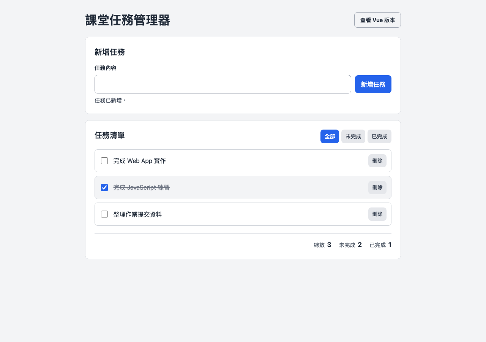 | 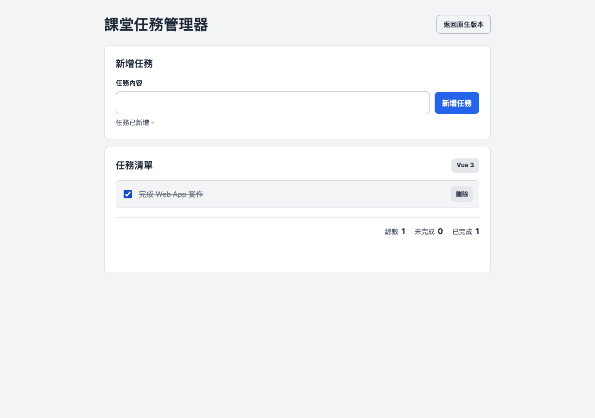 |

## 十　提交狀態與本人確認

程式由 Codex 產生；本報告測試紀錄由 Playwright 自動執行，學生本人確認尚待補充。

依本次整合要求，個人 AI 使用說明 B1–B4 暫不納入本報告，且未代寫個人採用方式、對話紀錄或反思。

提交前由學生本人完成下列欄位：

- [ ] 補填本報告首頁的課程、班級、姓名與學號。
- [ ] 親自開啟原生版及 Vue 版，操作 TC01–TC10。
- [ ] 記錄本人測試日期、瀏覽器版本及至少兩項操作前後證據。
- [x] 建立公開 GitHub 儲存庫與 GitHub Pages，並由 AI 驗證原生版及 `vue.html`。
- [ ] 本人以登出或無痕視窗確認網站、報告、程式碼與圖片均可開啟。

本人測試日期：＿＿＿＿＿＿＿＿＿＿  
本人測試瀏覽器：＿＿＿＿＿＿＿＿＿＿  
本人測試結果：＿＿＿＿＿＿＿＿＿＿  
本人簽名或確認：＿＿＿＿＿＿＿＿＿＿
