# 課堂任務管理器實作報告

## 1. Web App 與原始碼

- [原生 JavaScript 網站](https://wenanchang19.github.io/task-manager-classwork/)
- [Vue 網站](https://wenanchang19.github.io/task-manager-classwork/vue.html)
- [GitHub 原始碼](https://github.com/WenAnChang19/task-manager-classwork)

原生版支援新增、完成／取消完成、刪除、三種篩選及統計；Vue 版重新實作新增、完成與刪除。兩個版本的資料獨立，重新整理後任務清空。

## 2. 查核點證據

### Checkpoint 1-1：基本介面

標題、任務輸入欄、新增按鈕、清單、篩選和統計均存在；重新整理後基本介面保留。


### Checkpoint 1-2：語意化 HTML

原生版以 `header` 放置作品標題與版本切換，以 `main` 包住主要內容。新增區使用 `form` 和對應輸入欄的 `label`；任務區使用 `section`、標題關聯、篩選按鈕、`ul` 清單及統計區。下列片段是實際 [`index.html`](index.html) 第 42–61 行：

```html
<!-- 重要語意區：任務清單與操作狀態集中在這個 section。 -->
<section class="panel task-panel" aria-labelledby="list-heading">
  <div class="section-heading">
    <h2 id="list-heading">任務清單</h2>
    <div class="filters" aria-label="篩選任務">
      <button class="filter-button" type="button" data-filter="all" aria-pressed="true">全部</button>
      <button class="filter-button" type="button" data-filter="pending" aria-pressed="false">未完成</button>
      <button class="filter-button" type="button" data-filter="completed" aria-pressed="false">已完成</button>
    </div>
  </div>

  <p id="empty-state" class="empty-state">目前沒有任務</p>
  <ul id="task-list" class="task-list" aria-label="任務"></ul>

  <div id="stats" class="stats" aria-label="任務統計">
    <p>總數 <strong id="total-count">0</strong></p>
    <p>未完成 <strong id="pending-count">0</strong></p>
    <p>已完成 <strong id="completed-count">0</strong></p>
  </div>
</section>
```

`section` 透過 `aria-labelledby` 連到「任務清單」標題。靜態 HTML 先提供空的 `ul`；新增任務後，JavaScript 會建立真正的 `li`，每一項包含有文字標籤的 checkbox 與刪除 `button`。使用者輸入以 `textContent` 放入 `span.task-name`，不會被瀏覽器當作 HTML 執行。


### Checkpoint 2-1～2-3：CSS、RWD 與 Hover／Focus

桌面版採灰白背景、白色面板與藍色主要按鈕。`.page-width` 限制內容寬度，任務項目使用 grid 配置文字與刪除按鈕。`overflow-wrap: anywhere` 讓無空格長字串也能換行。

當寬度不超過 480px，標題列、表單與區段標題改成直向排列，新增按鈕填滿寬度，三個篩選按鈕維持三欄。Playwright 在 480、375、320px 都檢查 `scrollWidth` 不大於 viewport，並確認輸入、按鈕和刪除操作留在畫面內。

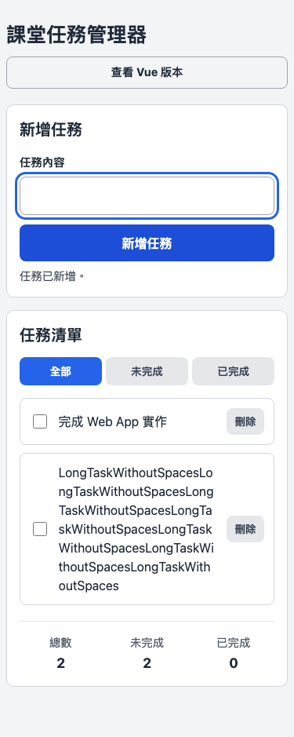

圖 2　375px 手機畫面；長字串換行，新增、篩選與刪除按鈕均在視窗內。

| hover 前 | hover 後 |
| --- | --- |
|  | 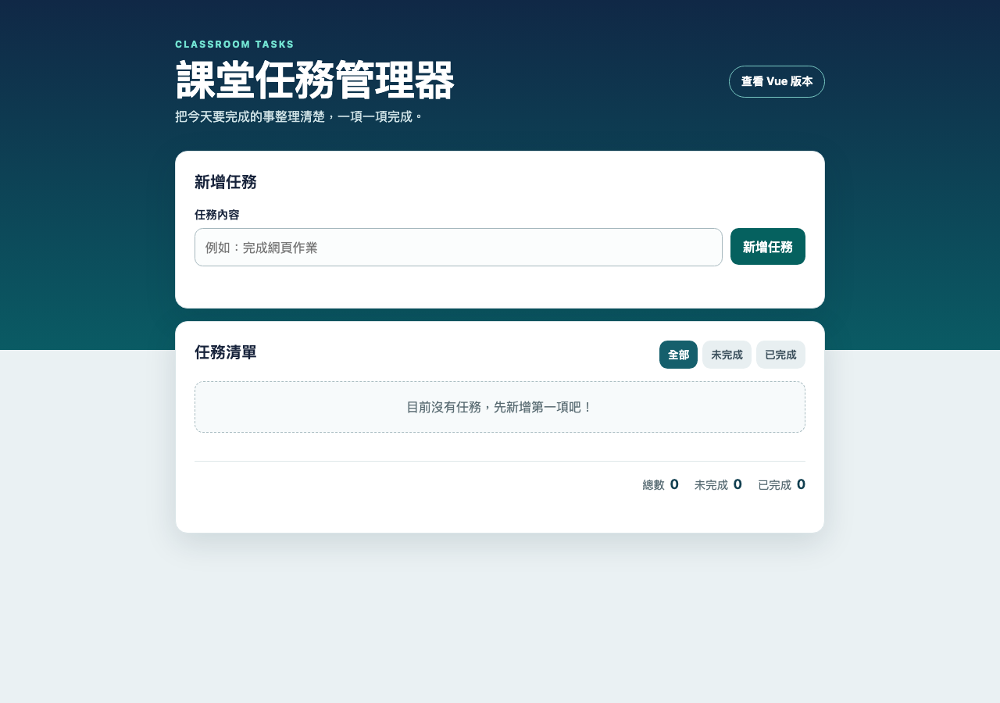 |

圖 3　新增按鈕背景色由 `rgb(37, 99, 235)` 變為 `rgb(29, 78, 216)`。鍵盤操作時，控制項也會顯示藍色 `focus-visible` 外框。

### Checkpoint 3-1～3-5：JavaScript 功能

#### 3-1 新增與空白檢查

表單提交時先用 `trim()` 移除頭尾空白。內容有效時加入 `{ id, name, completed: false }`，重設表單並重畫清單；空字串或純空白則顯示提示，不加入陣列。

| TC01 新增前 | TC01 新增後 |
| --- | --- |
| 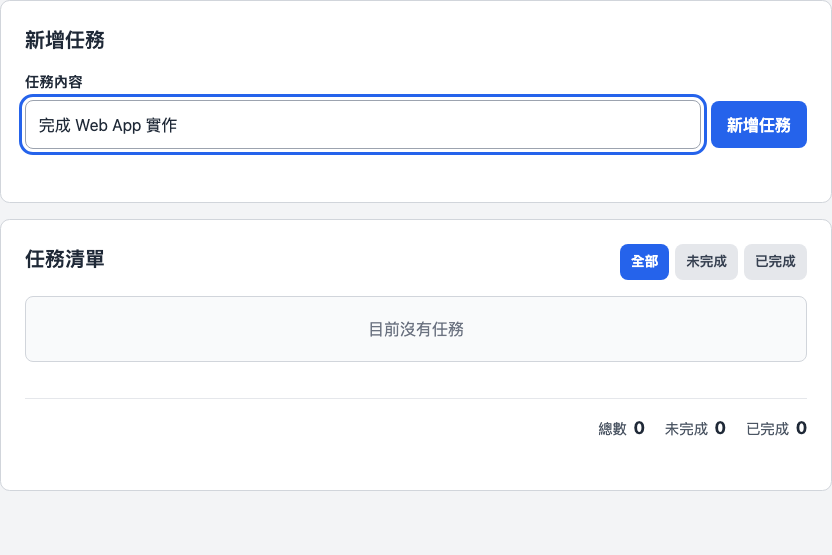 | 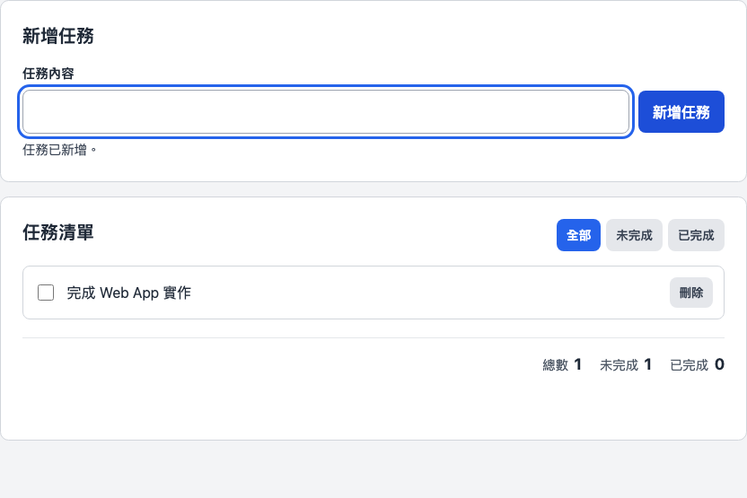 |

圖 4　新增前清單為空；新增後出現「完成 Web App 實作」，輸入清空，統計為 1／1／0。

| TC02 空白送出前 | TC02 空白送出後 |
| --- | --- |
| 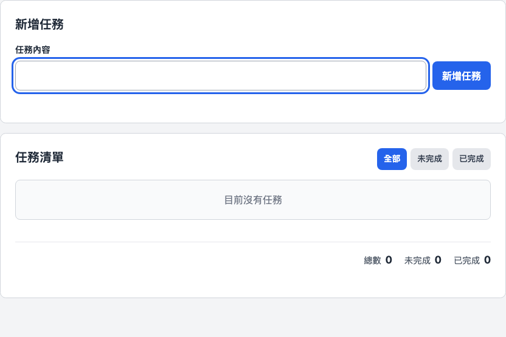 |  |

圖 5　送出純空白後沒有產生任務，提示「請輸入任務內容。」，統計維持 0／0／0。

#### 3-2 完成與取消完成

清單使用事件委派監聽 checkbox 的 `change`。程式依 `data-task-id` 找到對應資料，更新 `completed` 後呼叫 `renderTasks()`；再次取消勾選時使用相同流程恢復未完成。

| TC03 未完成 | TC03 完成 |
| --- | --- |
| 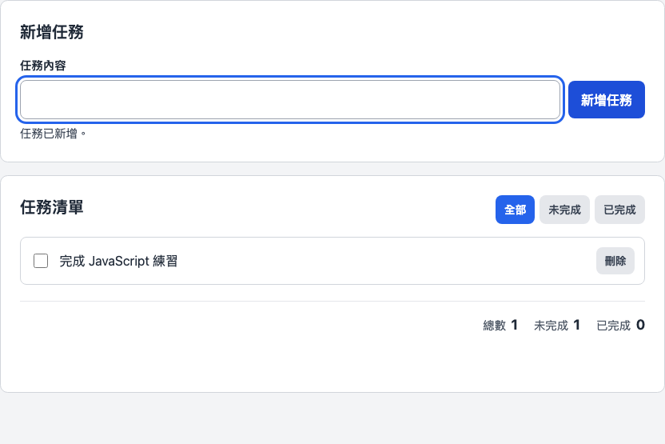 | 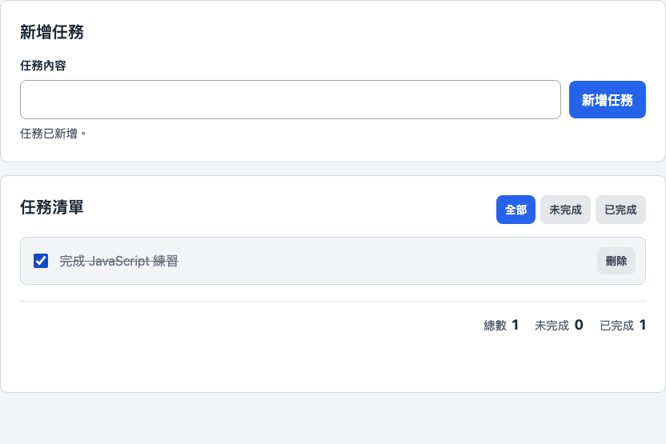 |

圖 6　完成後 checkbox 勾選、文字加上完成樣式，統計由 1／1／0 更新為 1／0／1；[取消完成證據](evidence/untoggle-after.png)顯示統計恢復 1／1／0。

#### 3-3 刪除指定任務

刪除按鈕帶有任務 ID。程式用 `findIndex()` 找到資料，再用 `splice()` 移除。下列 TC05 證據完整記錄操作前後，符合至少兩項 Test Case 需有前後證據的要求之一。

| TC05 刪除前 | TC05 刪除後 |
| --- | --- |
|  |  |

圖 7　刪除「完成 Web App 實作」後，只保留「整理作業提交資料」，統計由 2／2／0 變成 1／1／0。

#### 3-4 三種篩選

三張圖使用同一組資料：依序為 Web App、JavaScript、提交資料，中間的 JavaScript 任務已完成。篩選只建立顯示用陣列，不會改動原始 `tasks`，所以三種畫面的整體統計都維持 3／2／1。

| 全部 | 未完成 | 已完成 |
| --- | --- | --- |
| 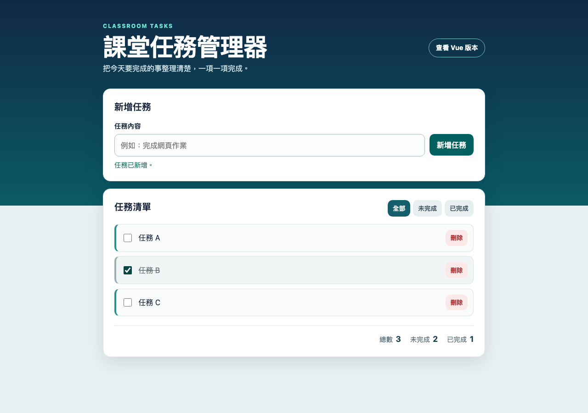 |  | 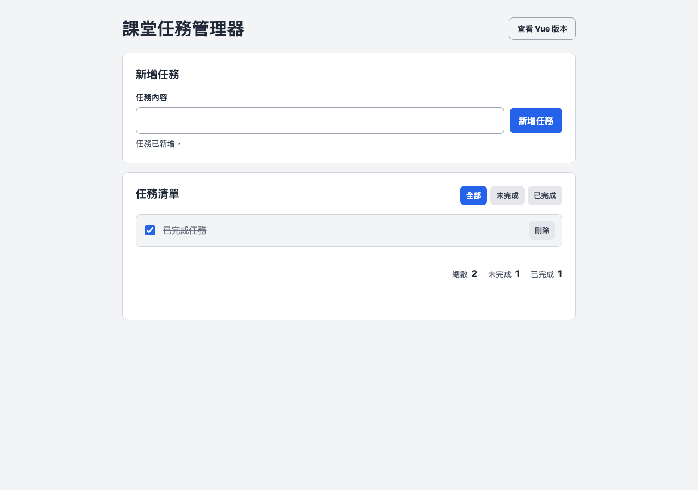 |

圖 8　全部顯示三項；未完成顯示第一與第三項；已完成只顯示中間任務。

#### 3-5 統計同步

`updateSummary()` 從完整 `tasks` 陣列計算完成數，再以總數減完成數得到未完成數，因此切換篩選不會改變統計。

| TC08 完成前 | TC08 完成後 |
| --- | --- |
| 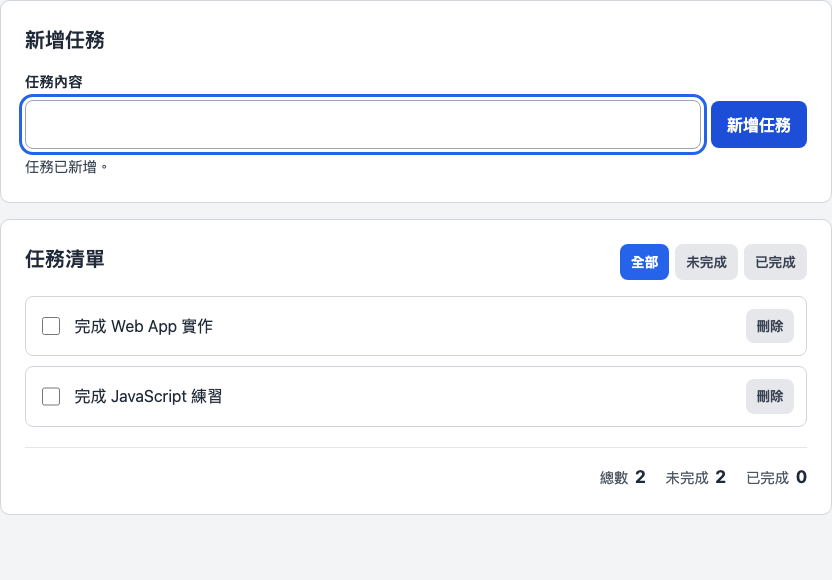 |  |

圖 9　將第一項標成完成後，統計由 2／2／0 更新為 2／1／1。

### 第四階段：JavaScript 程式驗證

下列是實際 [`app.js`](app.js) 第 3–30 行，共 28 行，符合題目要求的 10–30 行範圍。

```js
const tasks = [];
let nextTaskId = 1;
let activeFilter = "all";

const taskForm = document.querySelector("#task-form");
const taskInput = document.querySelector("#task-input");
const taskList = document.querySelector("#task-list");
const formMessage = document.querySelector("#form-message");
const emptyState = document.querySelector("#empty-state");
const filterButtons = document.querySelectorAll(".filter-button");

taskForm.addEventListener("submit", (event) => {
  event.preventDefault();
  const taskName = taskInput.value.trim();

  if (!taskName) {
    showMessage("請輸入任務內容。", true);
    taskInput.focus();
    return;
  }

  tasks.push({ id: nextTaskId, name: taskName, completed: false });
  nextTaskId += 1;
  taskForm.reset();
  showMessage("任務已新增。", false);
  renderTasks();
  taskInput.focus();
});
```

- 保存任務的資料：`tasks` 是陣列；每筆資料包含 `id`、`name`、`completed`。
- 新增任務的位置：`tasks.push(...)` 加入一筆預設未完成的任務。
- 更新畫面的位置：新增完成後呼叫 `renderTasks()`，重新產生清單並接著更新統計。
- 輸入檢查：`trim()` 搭配 `if (!taskName)` 同時拒絕空字串與純空白。
- ID 用途：`nextTaskId` 每次加一，即使任務同名也能準確完成或刪除指定項目。

完整流程是「事件修改 `tasks` → `renderTasks()` 依目前篩選建立 `li` → `updateSummary()` 依完整陣列更新三個數字」。完成、刪除和篩選的實作可直接在 [`app.js`](app.js) 查看。


### Checkpoint 5-1～5-4：Vue 版本

Vue 版使用 Options API。`data()` 提供 `tasks`、下一個 ID、輸入內容和訊息；`v-model` 連動輸入；`v-for` 依任務陣列建立清單；`computed` 計算總數、未完成與已完成。資料變更後由 Vue 更新畫面，不需要手動呼叫 `renderTasks()`。

| 5-1 初始掛載 | 5-2 新增後 |
| --- | --- |
|  |  |

圖 10　Vue 成功掛載，初始統計 0／0／0；新增後顯示一項任務與 1／1／0。

| 5-3 完成 | 5-3 取消完成 |
| --- | --- |
| 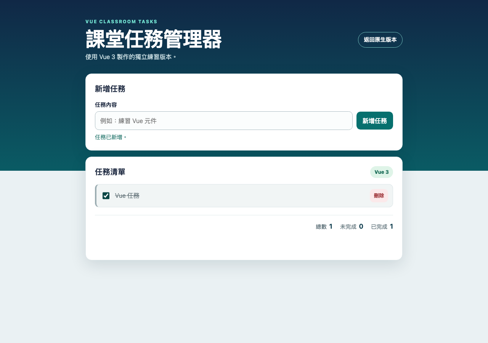 | 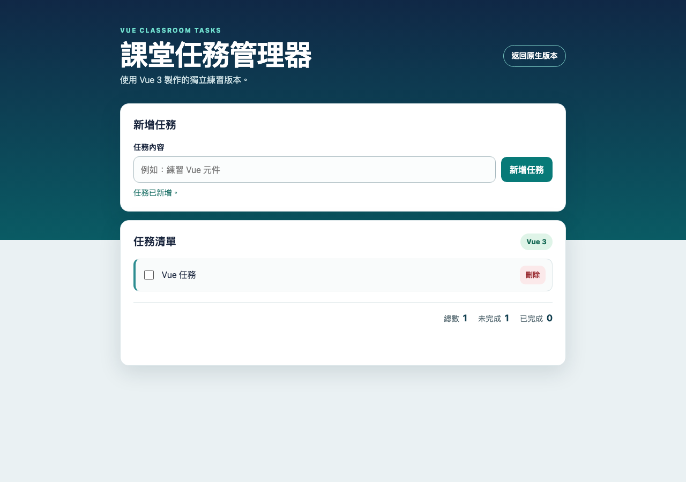 |

圖 11　`toggleTask()` 讓統計在 1／0／1 與 1／1／0 之間正確更新。


圖 12　`deleteTask()` 刪除唯一任務後，清單回到空狀態，統計為 0／0／0。

## 3. Unit Test 結果

執行者：Codex 使用 Playwright 自動操作 Chromium；不是學生親自測試紀錄。  
執行時間：2026-09-30 15:57:01（Asia/Taipei）。  
瀏覽器：Chromium 151.0.7922.34。  
結果：TC01–TC10 全部 PASS。

| Test Case | 測試內容 | 預期結果 | 實際結果 | 結果 | 證據 |
| --- | --- | --- | --- | --- | --- |
| TC01 | 新增正常任務 | 任務出現，輸入欄清空，統計 1／1／0 | 任務出現、輸入清空；統計 1／1／0 | PASS | [前](evidence/add-before.png)／[後](evidence/add-after.png) |
| TC02 | 新增空白任務 | 空字串與純空白皆不新增並顯示提示 | 兩種空白都沒有新增，顯示提示 | PASS | [前](evidence/blank-before.png)／[後](evidence/blank-after.png) |
| TC03 | 完成任務 | 勾選後變成已完成，統計同步 | 已勾選並顯示完成樣式；統計 1／0／1 | PASS | [前](evidence/toggle-before.png)／[後](evidence/toggle-after.png) |
| TC04 | 取消完成 | 取消勾選後恢復未完成 | 勾選取消、完成樣式移除；統計 1／1／0 | PASS | [取消前](evidence/toggle-after.png)／[取消後](evidence/untoggle-after.png) |
| TC05 | 刪除任務 | 指定任務消失，其餘任務保留 | 指定任務消失，另一項保留；統計 1／1／0 | PASS | [前](evidence/delete-before.png)／[後](evidence/delete-after.png) |
| TC06 | 篩選未完成 | 只顯示未完成，切回全部恢復所有任務 | 未完成只顯示第一與第三項；全部顯示三項；統計維持 3／2／1 | PASS | [全部](evidence/filter-all.png)／[未完成](evidence/filter-pending.png) |
| TC07 | 篩選已完成 | 只顯示已完成；沒有符合項目時顯示提示 | 只顯示中間的已完成任務；取消完成後篩選結果為空 | PASS | [已完成](evidence/filter-completed.png) |
| TC08 | 統計數字 | 新增、完成、刪除、篩選後皆正確 | 依序驗證 0／0／0、2／2／0、2／1／1、1／1／0；篩選不改變統計 | PASS | [前](evidence/stats-before.png)／[後](evidence/stats-after.png) |
| TC09 | 手機尺寸 | 480、375、320px 長文字不溢出，按鈕可操作 | 三種寬度皆無水平溢出；新增、篩選、完成、刪除可操作 | PASS | [375px 代表畫面](evidence/mobile375.png) |
| TC10 | Vue 功能 | Vue 啟動，新增、完成／取消、刪除立即更新 | Vue 已掛載；所有操作更新正確，拒絕空白；320px 無溢出 | PASS | [初始](evidence/vue-initial.png)／[新增](evidence/vue-add.png)／[完成](evidence/vue-completed.png)／[取消](evidence/vue-uncompleted.png)／[刪除](evidence/vue-deleted.png) |

TC02 與 TC05 均已在上方以操作前／後圖片完整呈現。自動測試也驗證任務名稱透過 `textContent` 或 Vue 文字插值顯示，輸入 `` 時不會建立圖片元素；重新整理後任務清空，但表單、清單區與統計介面仍存在。

## 4. AI 使用紀錄

### A. 是否使用 AI？

☑ 有使用 AI

### B1. 使用哪一個 AI？

OpenAI Codex。協助範圍包含程式生成、介面修改、自動測試、截圖與文件整理。

### B2. 三個開發對話


#### 對話一：篩選後刪除或勾選錯誤任務

① **遇到的問題**：用篩選清單的 `index` 操作原始 `tasks` 陣列，造成刪除或完成狀態套用到錯誤任務。

② **詢問**：「先用 `tasks.filter()` 顯示已完成任務，再呼叫 `deleteTask(index)`，為什麼會刪到其他項目？」

③ **AI 技術回答**：篩選陣列與原始陣列的索引可能不同。例如原始陣列的第三項，在篩選後可能變成第一項。操作按鈕應傳遞任務的固定 ID，再從原始陣列找到對應物件。

④ **目前程式的做法**：新增時使用 `nextTaskId` 建立 ID。原生版把 ID 放在 `data-task-id`；完成時以 `find()` 找到任務，刪除時以 `findIndex()` 找到原始位置後呼叫 `splice()`。

#### 對話二：手機版輸入框與長任務文字超出畫面

① **遇到的問題**：輸入框與新增按鈕無法在窄畫面縮小；長字串讓任務列變寬，把刪除按鈕推到視窗外。

② **詢問**：「在 480px 以下，輸入框把新增按鈕擠出畫面，長任務名稱也會讓刪除按鈕超出螢幕。CSS 要怎麼調整？」

③ **AI 技術回答**：輸入與文字區塊需要允許縮小，長字串需要換行。可使用 `min-width: 0`、`overflow-wrap: anywhere`，並在手機尺寸讓新增表單改為上下排列，保留按鈕可操作的空間。

④ **目前程式的做法**：輸入框設為 `flex: 1; min-width: 0`；任務名稱使用 `overflow-wrap: anywhere`。480px 以下，`.input-row` 採 `flex-direction: column`，新增按鈕寬度為 `100%`，篩選按鈕維持三欄。

#### 對話三：Vue 任務資料與畫面連動

① **遇到的問題**：把任務資料保存在 Vue 管理範圍外，或混用手動 DOM 操作與 Vue 模板，導致資料與顯示清單不同步。

② **詢問**：「原生 JavaScript 新增任務後要呼叫 `renderTasks()`。換成 Vue 後，該把資料放在哪裡，才能讓新增、完成與刪除立即更新畫面？」

③ **AI 技術回答**：把任務陣列放在 Vue 的 `data()`，模板使用 `v-for` 顯示資料，輸入欄以 `v-model` 連動。事件處理方法修改這份資料，由 Vue 更新清單；統計可使用 `computed` 計算。

④ **目前程式的做法**：`vue-app.js` 的 `data()` 提供 `tasks` 與 `newTaskName`。新增呼叫 `this.tasks.push(...)`，完成切換 `task.completed`，刪除呼叫 `this.tasks.splice(...)`。Vue 版不呼叫原生版的 `renderTasks()`。

### B3. 分析其中一段對話

以模擬對話一為例，固定 ID 可以解決「顯示順序不等於原始陣列順序」的問題。還需要保存目前篩選條件，才能在新增、完成或刪除後維持相同篩選。原生版使用 `activeFilter` 與 `getVisibleTasks()`，統計則從完整的 `tasks` 陣列計算。

這是對程式設計的分析；沒有將模擬 Bug 寫成學生實際遇到並自行修復的經歷。]


### B4. 不同建議的比較

選項 A：每次重畫任務清單，都替每個 checkbox 與刪除按鈕綁定事件。

選項 B：在父層 `ul` 綁定事件，以 `data-task-id` 找到點擊的任務。

目前原生版採用選項 B 的事件委派，讓重建後的任務仍可操作；任務元素使用 `createElement()` 建立，名稱以 `textContent` 顯示。這項比較說明目前程式的設計，並非一段已發生的個人採用紀錄。
